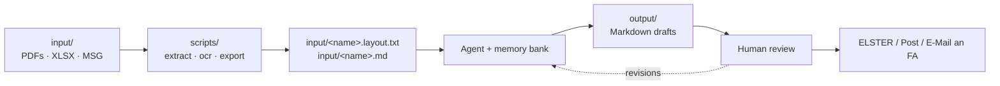

# Demo: Agentic Knowledge Work — Multi-Year Tax Case

> **Companion case study to** `demo-corpus-analysis.md`. Where the corpus
> demo is **synthetic and short** (12 emails, one contradiction, ~17 minutes),
> this study describes a **real, anonymised, multi-year project** that has
> been running for over a year against a six-year span of legal and financial
> records. Use it as the **closing showcase** in M11 of the 4-hour workshop,
> or as a written hand-out for a 2-hour audience that wants to see the
> operating model "at full scale."

## Overview

A private taxpayer engaged the agentic operating model to manage a
**six-year German income-tax case** (Veranlagungszeiträume [tax assessment
years] 2021–2026). The work spans three distinct legal phases:

1. **2021** — closed (final assessment served, reference anchor).
2. **2022 / 2023 / 2024** — active appeal (Einspruch [administrative appeal]
   filed 25.03.2026, reasoning due 30.04.2026, Fristverlängerung [deadline
   extension] negotiated for 2023/2024 to 31.07.2026).
3. **2025 / 2026** — upcoming filings.

Inputs are heterogeneous and arrive in waves:

- ~80 scanned PDFs per year (Microsoft-Lens phone scans, embedded OCR layer).
- Excel calculation sheets (`Steuer Kalkulation YYYY.xlsx`).
- An email archive exported from Outlook (~200 messages with attachments).
- Tax-office decisions (Einkommensteuerbescheide [income-tax assessment
  notices], Einspruchsantworten [appeal replies from the tax office]).
- A SmartSteuer ELSTER-preview PDF (SmartSteuer = commercial filing product;
  ELSTER = the official German online filing portal).

Outputs are **legally binding artefacts** — every figure must be defensible
to the Finanzamt (tax office) under the Abgabenordnung (German General Tax
Code). The agent does not file anything; it drafts, the human reviews,
signs, and submits.

> **Pedagogical payload**: the same workbench that builds software (git,
> Markdown, PowerShell, Python, an agent loop, a memory bank) is a
> **superior medium for adversarial reasoning** over years of unstructured
> evidence. The diff is the audit trail. The branch is the strategy
> alternative. The memory bank is the case file.

---

## Audience

Use this case study with audiences that immediately ask "but this is just
for code, right?" — particularly:

| Profile | Fit |
|---|---|
| Legal / tax / compliance professionals | **Primary** |
| Consultants handling multi-year client matters | **Primary** |
| Operations leads with long-running incident files | Strong |
| Researchers with multi-modal source material | Strong |
| Developers who think their craft does not transfer | Useful contrast |

---

## German Tax Terminology — Quick Glossary

For non-German audiences. The case study uses authentic German legal
terminology because the artefacts (file names, memory-bank entries, statute
citations) are reproduced from the real, anonymised project. Each term is
glossed in brackets on first use; this table is the master reference.

| German term | English equivalent |
|---|---|
| Veranlagungszeitraum (VZ) | tax assessment year |
| Einkommensteuer (ESt) | personal income tax |
| Einkommensteuerbescheid | income-tax assessment notice |
| Einspruch | formal administrative appeal against an assessment |
| Einspruchsfrist | deadline for filing the appeal (one month) |
| Einspruchsbegründung | written grounds for the appeal |
| Einspruchsantwort | tax office's reply to the appeal |
| Bekanntgabedatum | legally deemed date of service of the assessment |
| 4-Tage-Fiktion | four-day deemed-service rule (since 01.01.2025) |
| Fristverlängerung | extension of a procedural deadline |
| Wiedereinsetzung (in den vorigen Stand) | reinstatement after a missed deadline |
| Ruhen des Verfahrens | stay of proceedings (§ 363 Abs. 2 AO) |
| Finanzamt (FA) | tax office (the administrative authority) |
| Abgabenordnung (AO) | German General Tax Code (procedural statute) |
| Einkommensteuergesetz (EStG) | German Income Tax Act |
| Steuererklärung | tax return |
| Schriftsatz | formal legal pleading / written submission |
| Stammdaten | master data (year-independent base records) |
| Verfahren | (administrative) proceedings |
| Werbungskosten | income-related deductible expenses |
| AfA (Absetzung für Abnutzung) | depreciation for wear and tear |
| AHK (Anschaffungs-/Herstellungskosten) | acquisition / production costs (= depreciable base) |
| § 7h EStG | accelerated depreciation for redevelopment-zone properties |
| Kaufvertrag | purchase contract (here: real-estate deed) |
| Mieteinnahmen | rental income |
| Schuldzinsen | mortgage / loan interest |
| Lohnsteuer(bescheinigung) | wage tax (certificate from employer) |
| IdNr. (Identifikationsnummer) | personal tax identification number |
| Steuernummer | tax-office case number for the taxpayer |
| Anschrift | postal address |
| Belegmappe | documented bundle of supporting receipts |
| Beleg | receipt / supporting document |
| ELSTER | the official online filing portal |
| SmartSteuer | a popular commercial tax-return product feeding ELSTER |
| Vorschau | preview (the SmartSteuer ELSTER-preview PDF) |

---

## What the Repository Looks Like

Anonymised tree (real project has six year folders, ~80 documents per year,
and ~200 emails):

```text
steuerfall-mustermann/
├── .memory-bank/
│   ├── case-est-overview.md            # parties, FA, IDs, cross-refs
│   ├── case-est-2021.md                # 🟢 closed (reference)
│   ├── case-est-2022.md                # 🟡 active
│   ├── case-est-2023.md                # 🟡 active
│   ├── case-est-2024.md                # 🟡 active — critical anomaly here
│   ├── case-est-2025.md                # ⚪ upcoming
│   ├── case-est-2026.md                # ⚪ upcoming
│   ├── stammdaten-immobilien.md        # AfA, AHK, § 7h/§ 7i per Objekt
│   ├── stammdaten-parteien.md          # IdNr., Steuernummer, FA, Anschrift
│   ├── deadlines.md                    # all live deadlines, sortable
│   ├── documents-produced.md           # register of every artefact
│   ├── session-log.md                  # chronological work log
│   └── restructuring-plan.md           # binding blueprint for next reorg
├── input/
│   ├── _stammdaten/                    # year-INDEPENDENT (contracts, AHK)
│   │   ├── Immobilien/<Objekt>/
│   │   ├── Darlehen/
│   │   ├── Versicherungen/
│   │   └── Personen/
│   ├── 2021/.../Bescheid|Steuererklaerung|Lohnsteuer|...
│   ├── 2022/.../Bescheid|Einspruch|Steuererklaerung|...
│   ├── 2023/.../...
│   ├── 2024/.../...
│   ├── 2025/.../...
│   ├── 2026/.../...
│   ├── _verfahren/                     # FA correspondence (cross-year)
│   └── emails/                         # chronological 2021-2026
├── output/
│   ├── _verfahren/                     # cross-year Schriftsaetze
│   │   ├── 260325 Einspruch ESt 2022-2024.md
│   │   └── 260430 Einspruchsbegruendung und Fristverlaengerung.md
│   ├── 2021/                           # reference computations
│   ├── 2022/
│   │   ├── Index 2022.md
│   │   └── Abgleich Kalkulation vs Smartsteuer 2022.md
│   ├── 2023/ … 2026/
└── scripts/
    ├── extract_pdf.py                  # pymupdf, layout-sorted text
    ├── ocr_pdf.py                      # Tesseract fallback for image-only PDFs
    ├── extract_xlsx.py                 # XLSX -> Markdown table
    ├── build_index_2022.py             # walks input/2022/ -> Markdown index
    └── Export-TaxEmails.ps1            # Outlook COM -> Markdown email corpus
```

> **Two-axis separation.** The single most important structural decision was
> splitting **year-specific** evidence from **year-independent Stammdaten**
> [master data] (contracts, AfA [depreciation] bases, loan masters). Without
> it, the same Kaufvertrag [purchase contract] ended up duplicated in 2021/,
> 2022/, and 2024/. With it, every yearly case file links to one canonical
> source.

---

## Memory Bank — A Case File the Agent Can Read

The memory bank is **not** a project log. It is the case file. Every entry
is structured for retrieval, not narrative.

### `deadlines.md` (excerpt)

The table is in the project's working language (German). English reading
aid: *Datum* = date · *Was* = what · *Status* = status · *erledigt* = done
· *in Arbeit* = in progress · *offen* = open · *regulär* = on the regular
statutory schedule.

```markdown
| Datum       | Was                                                     | Status   |
|-------------|---------------------------------------------------------|----------|
| 02.04.2026  | Einspruchsfrist ESt 2022/2023/2024                      | ✅ erledigt (25.03.2026) |
| 30.04.2026  | Einspruchsbegründung 2022 + Fristverlängerung 2023/2024 | 🟡 in Arbeit |
| 31.07.2026  | Begründung Einspruch 2023/2024 nach § 109 AO            | ⚪ offen |
| 31.07.2026  | Steuererklärung ESt 2025 (regulär)                      | ⚪ offen |
```

In English: appeal-filing deadline (done early); appeal grounds for VZ
2022 plus deadline-extension request for 2023/2024 (in progress); appeal
grounds for 2023/2024 under § 109 AO (open); regular tax-return deadline
for VZ 2025 (open).

### `session-log.md` (excerpt — newest at bottom)

The log is kept in German because the supporting evidence and statutes are
German. An English summary follows the block.

```markdown
## 20.04.2026 — Erstaufnahme + Scan-Verbesserung
- 3 PDFs (Bescheide 2022/2023/2024) per pymupdf extrahiert -> .txt + .layout.txt
- Memory bank aufgebaut.
- **Kritischer Befund**: Einspruchsentwurf nutzte Zugangsdatum 01.03.2026.
  Seit 01.01.2025 gilt § 122 Abs. 2 Nr. 1 AO i.d.F. PostModG (4-Tage-Fiktion).
  Korrektes Bekanntgabedatum: 02.03.2026 (Mo, da 01.03. Sonntag, § 108 III AO).
  Einspruchsfrist endet damit 02.04.2026 — **NICHT** 01.04.2026.

## 20.04.2026 — Klärung Einspruchsstatus + FA-Antwort
- Einspruch wurde am 25.03.2026 fristgerecht eingereicht.
- FA-Antwort eingegangen, Sachbearbeiterin Frau <Name>, Frist 30.04.2026.
- Strategie-Optionen A/B/C dokumentiert; Variante C (gestaffelt) gewählt.

## 20.04.2026 — Volltext-Extraktion input/2022 + Abgleich Kalkulation ⇆ Smartsteuer
- 76 PDFs + 2 XLSX + 1 JPG vollständig durchsuchbar gemacht.
- 12 Korrekturpunkte zwischen interner Kalkulation und Smartsteuer-Vorschau
  identifiziert; jeder Punkt mit Beleg-Link in input/2022/.
```

**English summary of the three log entries:**

1. **Initial intake + scan improvement.** Three assessment notices
   (Bescheide) extracted to text via `pymupdf`; memory bank built. *Critical
   finding*: the draft appeal used the wrong service date (Zugangsdatum)
   01.03.2026. Since 01.01.2025, § 122 Abs. 2 Nr. 1 AO (as amended by the
   Postal Modernisation Act) imposes a four-day deemed-service rule
   (4-Tage-Fiktion). Correct deemed-service date (Bekanntgabedatum) is
   02.03.2026 — Monday, because 01.03. is a Sunday and § 108 Abs. 3 AO
   shifts the date to the next working day. The appeal deadline therefore
   ends 02.04.2026, **not** 01.04.2026.
2. **Clarifying appeal status + tax-office reply.** Appeal filed in time on
   25.03.2026. Tax-office reply received, naming the assigned case officer
   (Sachbearbeiterin) and the new deadline 30.04.2026. Strategy options A,
   B, C documented; option C (staggered: file 2022 fully, extend
   2023/2024) chosen.
3. **Full-text extraction of `input/2022/` + reconciliation calculation
   against SmartSteuer preview.** 76 PDFs, 2 Excel files, 1 image made
   fully searchable. Twelve correction points (Korrekturpunkte) identified
   between the internal calculation and the SmartSteuer preview, each with
   a link to the supporting document (Beleg) in `input/2022/`.

> **Teaching point**: a session log written in this register is **legally
> usable**. It documents what was known, when, and what action followed.
> Try doing that in a chat history.

---

## The Pipeline — One Pattern, Three Languages



**Why three languages?**

- **Python** for `pymupdf` (best PDF text-layer extraction) and Tesseract
  fallback for image-only scans.
- **PowerShell** for Outlook COM access (`Export-TaxEmails.ps1`) — the only
  realistic way to extract emails with attachments and recipients on
  Windows.
- **Markdown + the agent** for everything downstream: indexing, comparison,
  drafting, citation.

The agent **wrote all three** under instruction. The human chose the tool;
the agent produced the implementation.

---

## What the Agent Produces

### `Abgleich Kalkulation vs Smartsteuer 2022.md`

A two-column reconciliation between the taxpayer's internal Excel
calculation and the SmartSteuer ELSTER preview, with twelve numbered
correction points. Every row has:

- the value from each side,
- the delta,
- a Markdown link back to the source document in `input/2022/`,
- a recommended action (`korrigieren in SmartSteuer` / `Beleg fehlt` / `OK`).

### `260430 Einspruchsbegruendung und Fristverlaengerung.md`

File name in English: *Appeal grounds and deadline-extension request*. A
formal **Schriftsatz** [legal pleading] — the document submitted to the
Finanzamt. It cites the operative statutes at the points where each
applies:

| Citation | What it governs |
|---|---|
| § 122 Abs. 2 Nr. 1 AO | deemed service of the assessment notice |
| § 109 AO | extending a procedural deadline |
| § 152 AO | late-filing surcharge |
| § 363 Abs. 2 AO | stay of proceedings (Ruhen des Verfahrens) |
| § 7h EStG | accelerated depreciation for redevelopment-zone properties |

Every factual claim about income, expenses, or property cost basis
(Anschaffungs-/Herstellungskosten, AHK) carries an inline reference to a
file under `input/`.

### `Email-Befunde ESt 2022-2024.md`

File name in English: *Email findings — income tax 2022–2024*. A timeline
distilled from ~200 exported emails, surfacing every message where the
taxpayer or the property manager committed to a deductible position. Used
to support Werbungskosten [income-related deductible expenses] claims
that the Finanzamt challenged.

---

## The Three Hard Lessons

### 1. Deadlines are computed, not remembered

The taxpayer's draft Einspruch [appeal] used a **wrong** Bekanntgabedatum
[deemed-service date]. The agent, prompted to verify the deadline against
current AO law, found the **4-Tage-Fiktion** [four-day deemed-service rule,
in force since 01.01.2025] and the **§ 108 Abs. 3 AO** weekend rule (a
deadline falling on a Sat/Sun/holiday shifts to the next working day). The
corrected deadline was **two days later** than what the human had
calculated. Two days is the difference between a timely appeal and a
permanently lost case — recoverable only by *Wiedereinsetzung in den
vorigen Stand* (reinstatement after a missed deadline), which carries a
high evidentiary burden.

> **Operating model takeaway**: instruction file rule — *"For every legal
> deadline, recompute it from the underlying statute. Cite the section."*

### 2. The Stammdaten / Veranlagungszeitraum split

(Master data / tax-assessment-year split.)

The first three months of the project mixed master data (contracts, AfA
[depreciation] bases) with year-specific evidence (rent receipts, interest
certificates). The same Kaufvertrag [purchase contract] from 2017 lived in
`input/2021/` and `input/2022/`, diverging slightly each time it was
edited.

Solution: a `restructuring-plan.md` in the memory bank, executed across
**three commits on a feature branch** (`restruct-2026-05`), each with a
validation checklist (`grep` for dead path references, manual review of
all `output/**/*.md` links). The final tree separates `_stammdaten/` from
year folders; year folders link **into** Stammdaten, never duplicate it.

> **Operating model takeaway**: when structure breaks down, **plan the
> reorg as a document in the memory bank, then have the agent execute it
> commit-by-commit.** Reversible. Reviewable. Testable.

### 3. Branches are strategy alternatives

Faced with the 30.04.2026 deadline and three years to defend, the
attorney-equivalent had three options (A: extension only; B: full
substantive reasoning; C: 2022 fully filed + 2023/2024 extended). The
agent drafted all three on three branches (`strategy-a`, `strategy-b`,
`strategy-c`). The human compared the resulting Schriftsätze [legal
pleadings] side-by-side via `git diff` and chose C.

> **Operating model takeaway**: the equivalent of A/B testing for legal
> argument is `git checkout -b`. Try the firm tone on one branch, the
> conciliatory tone on another, diff them.

---

## What Makes This "Agentic" and Not "AI Help"

| Trait | Manifestation |
|---|---|
| **Versioned context** | Six years of evidence + memory bank, all in git |
| **Autonomous execution** | Agent wrote `extract_pdf.py`, `Export-TaxEmails.ps1`, the index, the Schriftsatz [legal pleading] drafts |
| **Self-verification** | After every restructure: `git status`, grep for dead paths, manual link review |
| **Instruction-driven** | "Cite every figure", "recompute every deadline from statute", "never invent a fact" |
| **Human oversight** | Human signs and submits; agent never touches ELSTER |
| **Traceability** | Every change a commit; every commit references a memory-bank entry |

---

## Talking Points When You Show This

> "This taxpayer is not a developer. The repository is not a software
> project. There is no test suite, no CI, no deployment. And yet — the
> agentic operating model applies cleanly. The memory bank holds the
> case. Git records every revision. PowerShell and Python are scaffolding
> for the agent. Markdown is the language of the final artefact."

> "Notice what is **not** here: a chat history with the AI. The reasoning
> lives in `session-log.md`. The decisions live in commit messages. The
> evidence lives in `input/`. The product lives in `output/`. None of it
> is locked inside a vendor's chat UI."

> "Now imagine doing this with five clients. Twenty. The pattern scales.
> The chat window does not."

---

## Data Governance Sidebar

This case study is **anonymised**. The real repository contains:

- Real names, addresses, IdNr. (personal tax identification number),
  Steuernummer (the tax office's case number for the taxpayer), FA
  contact details.
- Loan account numbers, property cost bases (AHK), bank statements.
- Legally privileged correspondence with the tax office.

It is **a private repository**. Before any audience replicates this
pattern with their own data, walk them through:

- Copilot data-handling tier (Enterprise / Business / Individual).
- Content exclusion settings.
- Which model received which prompt.
- `.gitignore` patterns for raw evidence (the source PDFs are kept locally
  but committed; the choice depends on the matter).
- For German contexts: § 203 StGB (legal/medical professional secrecy),
  Art. 5/6/9 DSGVO data minimisation.

See M11 slide 11.9 (Data Governance & Confidentiality) and the
`german-legal-research` skill in CopilotAtelier.

---

## Hand-Out Variant (No Live Demo)

If the audience is non-technical (legal, tax, consulting), do **not** run
this live. Instead:

1. Show the directory tree on screen.
2. Show one memory-bank file (`deadlines.md` or `case-est-2024.md`).
3. Show one `output/*.md` Schriftsatz [legal pleading] with citations.
4. Show `git log --oneline` for the case.
5. Show the three-branch strategy diff.

Total: 8–10 minutes. The visual of "this is what the case file looks
like" lands harder than any live agent prompt.

---

## What the Audience Should Leave With

- **Multi-year, high-stakes knowledge work fits the same operating model
  as code.** Memory bank, versioning, branches, citations, instruction
  files.
- **Heterogeneous inputs (PDF, XLSX, MSG, scans) are normalised by
  agent-written scripts.** The agent picks the language; you specify the
  contract.
- **Deadlines, citations, and structural rigour are instruction-file
  concerns.** Set them once, hold them across years.
- **The diff is the audit trail.** No paralegal, no engineer, no
  consultant produces a more defensible record by hand.
- **Privacy and governance are non-negotiable** when the data is real.
  Use private repos, the right Copilot tier, `.gitignore` for raw
  evidence, and document everything.

---

## Cross-References

- `content/demos/demo-corpus-analysis.md` — the synthetic short version of
  the same pattern.
- `content/materials/agentic-knowledge-work-patterns.md` — the seven
  patterns this case study demonstrates, abstracted for reuse.
- `content/slides/11-beyond-code.md` — the M11 slides this case study
  closes.